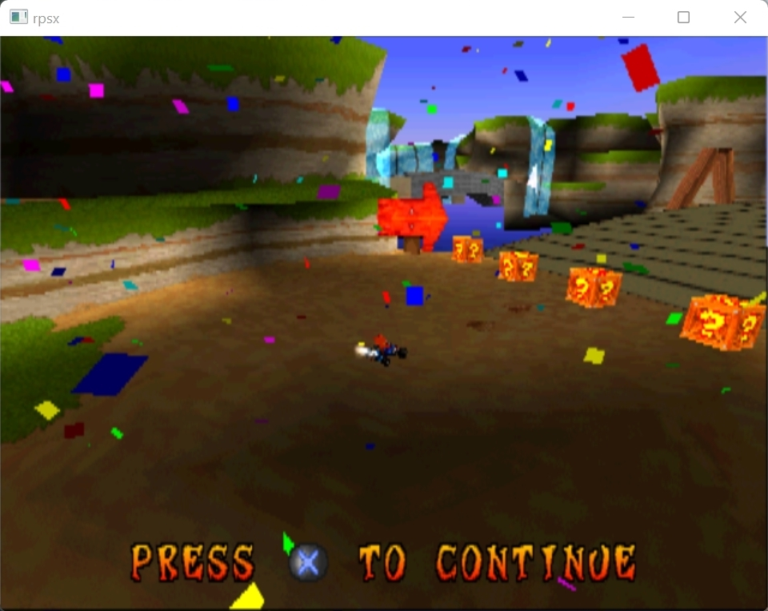
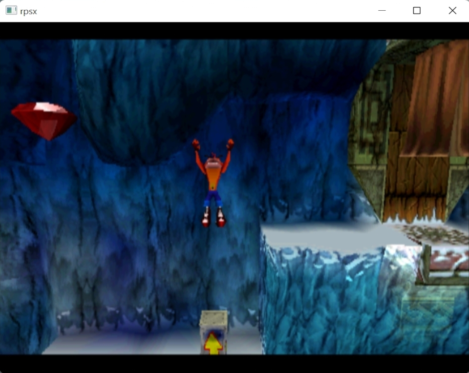
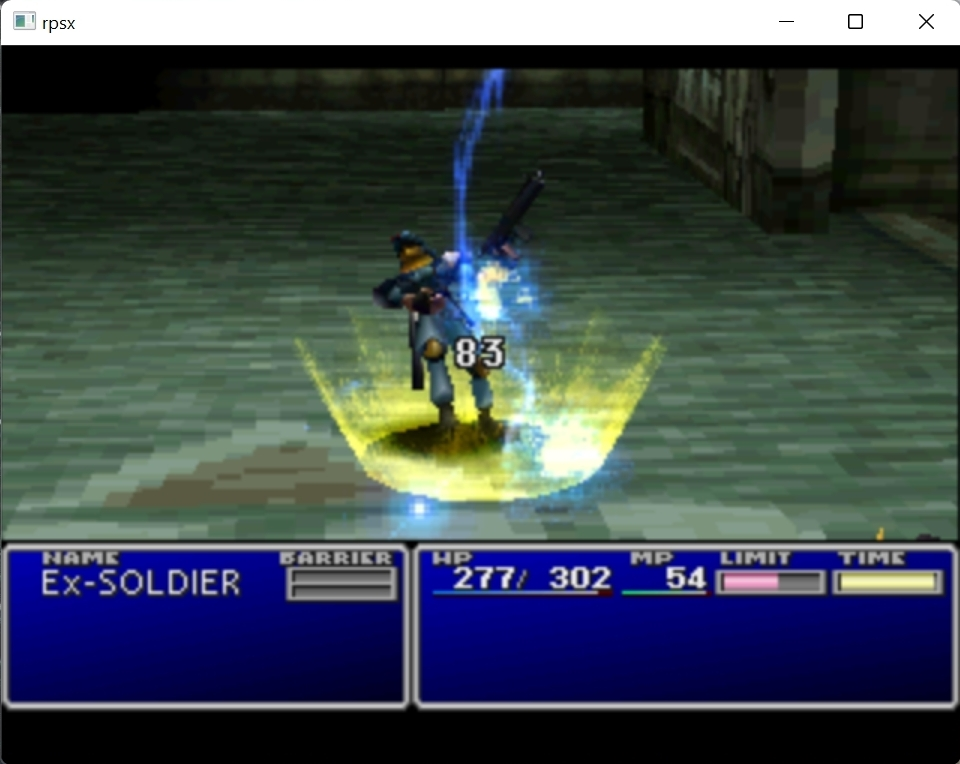
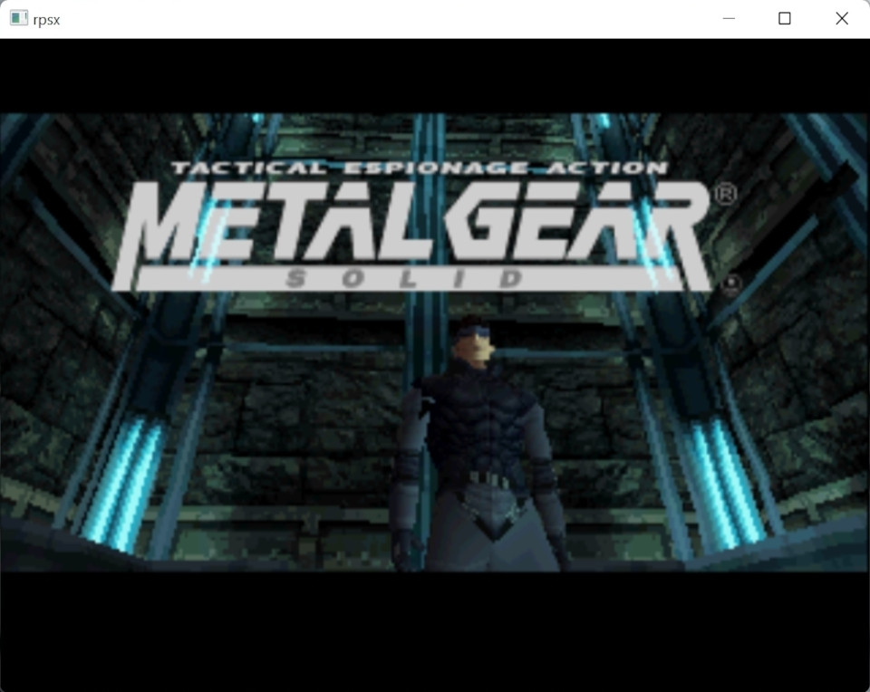
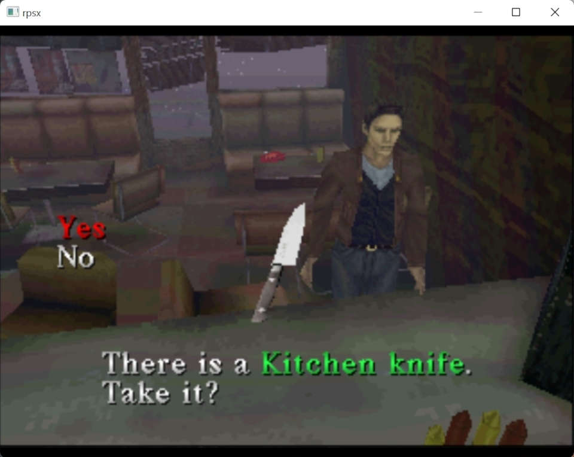
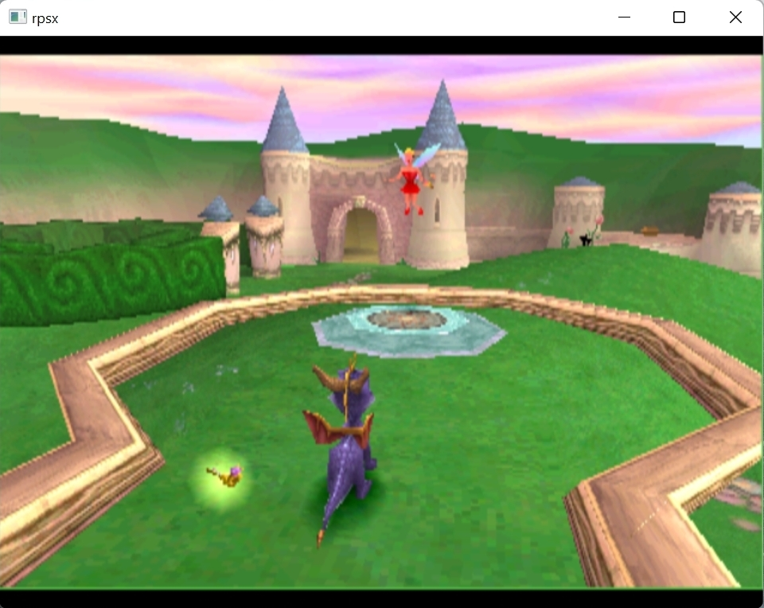
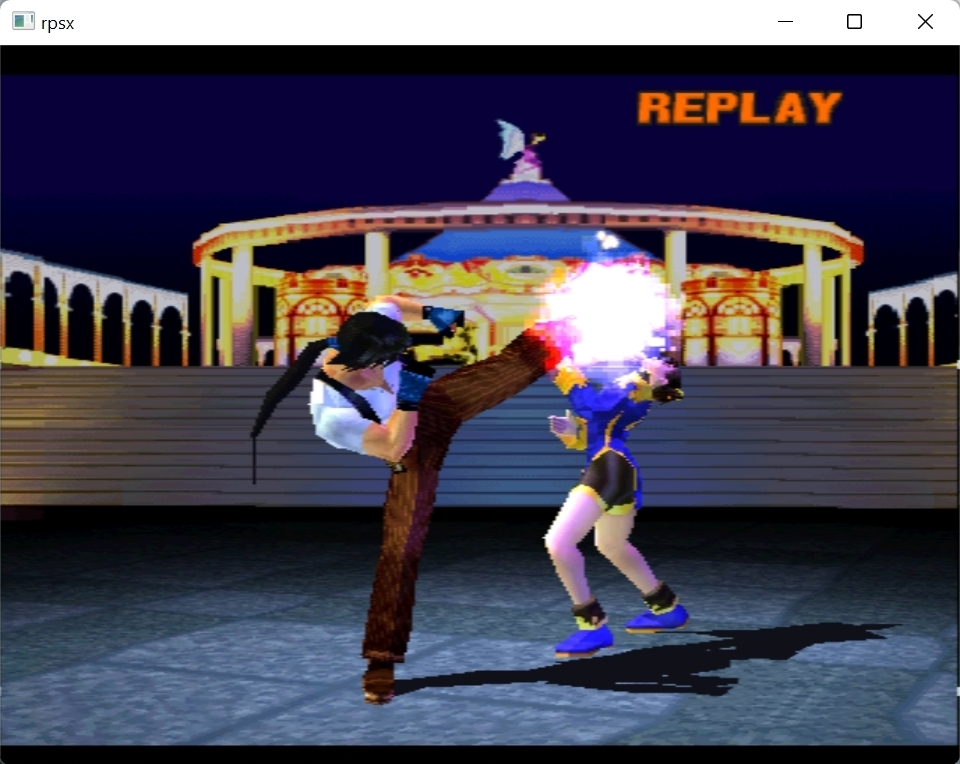
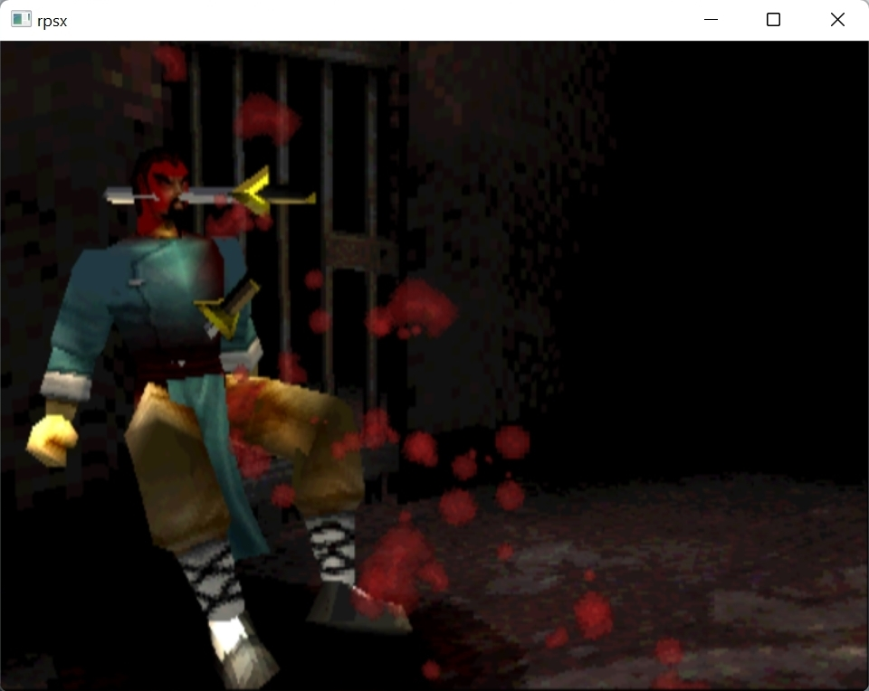

# rpsx
A PlayStation emulator written in Rust as a hobby project.

Most components of the PlayStation are implemented, and many popular games are playable.

# Screenshots

    
    

    
    

    
	

    
    

    
    

